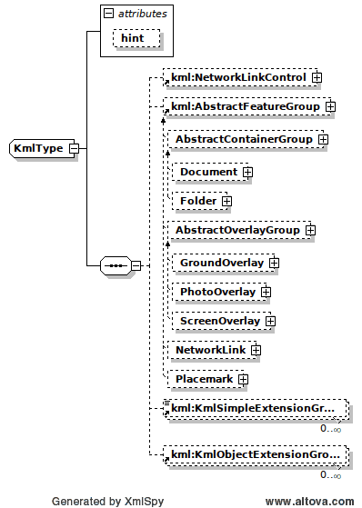

# lib-gis-kml

**A KML reader and writer.**

Provides automatically generated full reference implementation of the KML object
model defined by OGC’s KML standard and Google’s GX extensions. It is an object
orientated API that enables the convenient and easy use of KML in existing Java
environments.

KML is an XML-based language schema that describes and visualizes geographic
data. The language is often used in 2D web based maps and 3D virtual globes.
Originally developed for Google Earth as a means of maintaining and exchanging
geographical data, the language was defined by the Open Geospatial Consortium
(OGC) as a standard in April 2008. So far, many virtual globes, like for example
NASA’s Earth Wind and Microsoft’s Virtual Earth, have adopted the KML language
as their data format of choice.

In order to ensure convenient and easy use of KML in existing Java-systems, an
object oriented API is necessary. APIs for XML dialects are implemented using two
layers. The current official XML schema of KML in conjunction with the JAXB
technology is used to generate Java class representations automatically. KML’s
schema is a document describing the correct syntax of KML files and can, therefore,
be used for validating the corresponding KML files. The semantic application
layer, which is found on top of the JAXB layer, is abstracted from the raw generated
classes and defines a well-shaped API.

This library started with a fork of code from the micromata.de Java API for KML
(JAK) project, then made a quick u-turn to provide only standard-compliant
functionality in support of our GIS DTO library.

# History

 * v0.0.1 - create new project and compile
 * v1.0.0 - KML writer working just fine, thank you
 * v1.0.1 - update lib dependencies
 * v1.1.0 - remove DTO KML writer - this lib is KML only

# License

Copyright (C) 2017 Key Bridge. GNU General Public License Version 3.

# References

  * [OGC KML v2.2](doc/xsd/ogckml22.xsd)  XML Schema Document for OGC KML
  * [KML Extension v2.2](doc/xsd/kml22gx.xsd)  Google extensions to OGC KML

